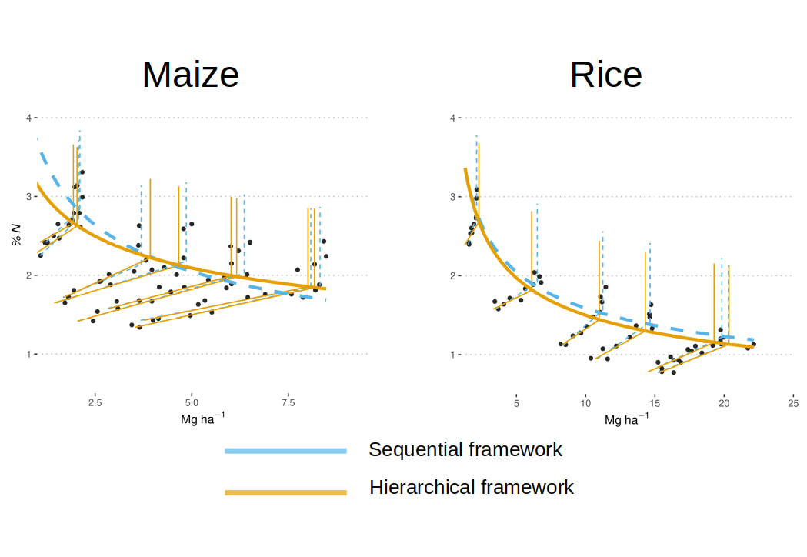

# Results  

## Field data  

Both frameworks resulted in different estimates for A1 and A2 and, consequently, %NC. This will have an effect on the estimations for N requirements to achieve %NC (see Figure 2 of the poster).    

