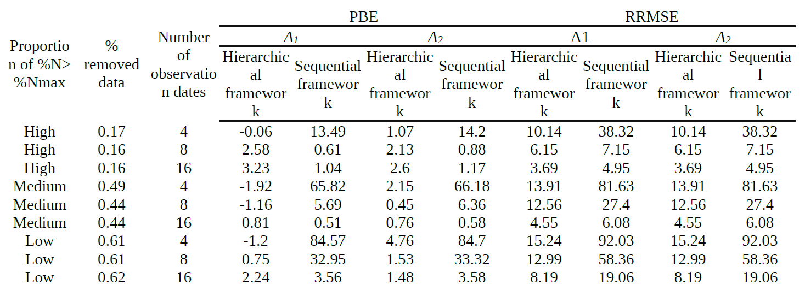
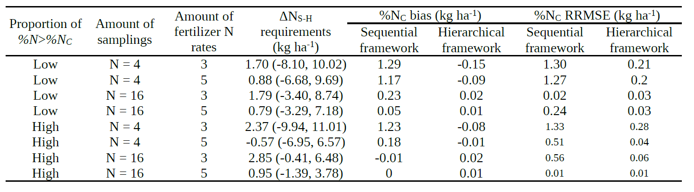

# Results  

## Simulation study  

Overall, the hierarchical model outperformed the sequential model in all aspects.  

**Table 1.** Relative root mean squared error (RRMSE) and percentage bias error (PBE, %) for A1 and A2 with the sequential and hierarchical frameworks, for different types of datasets with 5 N rates.  

**Table 2.** Difference between absorbed N required to reach %NC as %NC (sequential) – %NC (hierarchical), and bias and root mean squared error (RMSE) in %NC estimation (in %) with *W*=10 Mg ha-1, for a selection of scenarios of different combinations of data.  

**Figure 1.** Difference between absorbed N required to reach %NC as %NC (sequential) – %NC (hierarchical), as a fuction of biomass, for the simulation study.  

