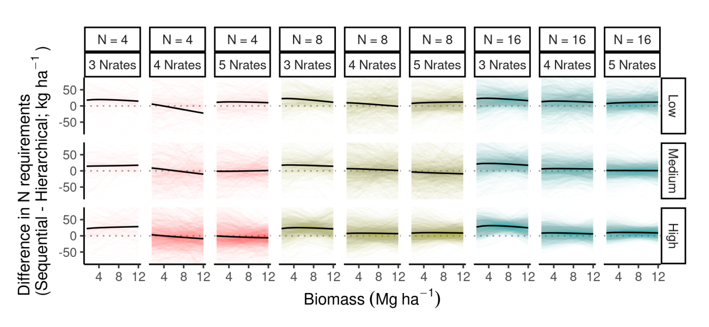

# Results  

## Simulation study  

Overall, the hierarchical model outperformed the sequential model in all aspects.  

### Percentage bias error and relative root mean squared error of %NC  

### Percentage bias error and relative root mean squared error of A1 and A2  

### Coverage probability    

